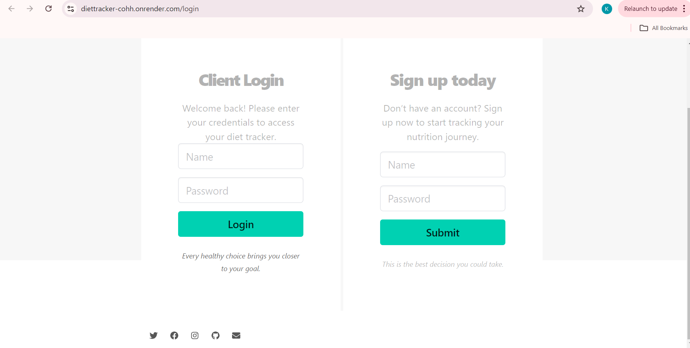
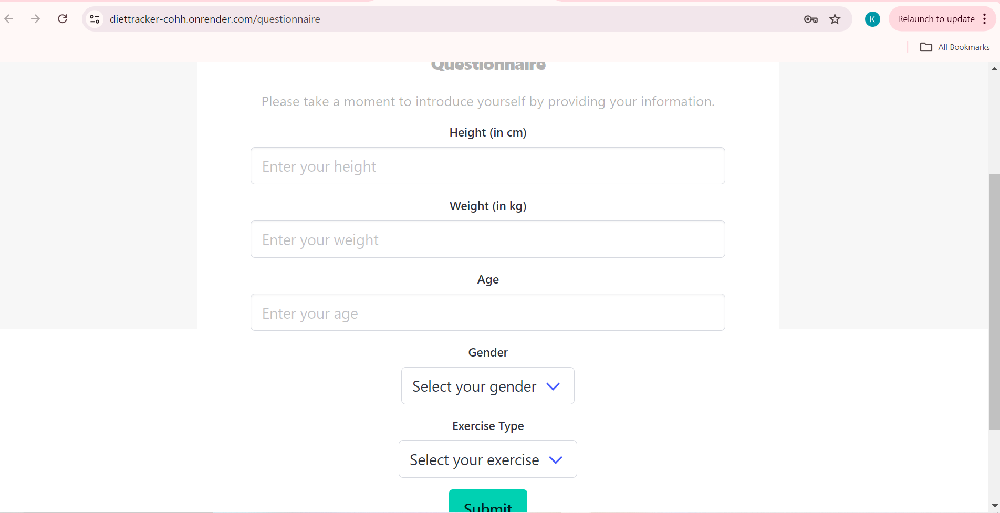
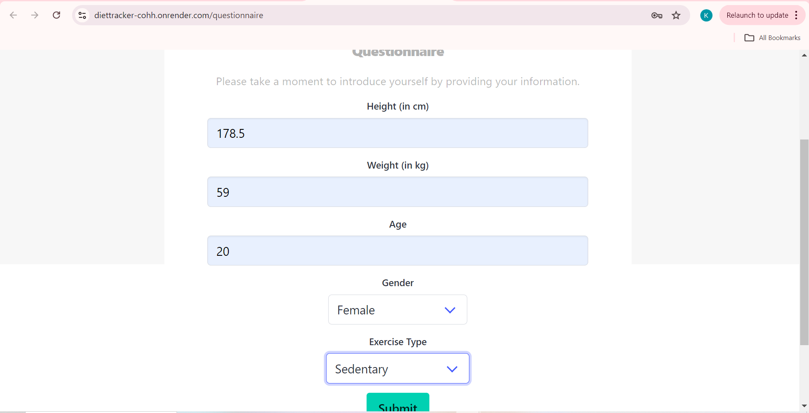
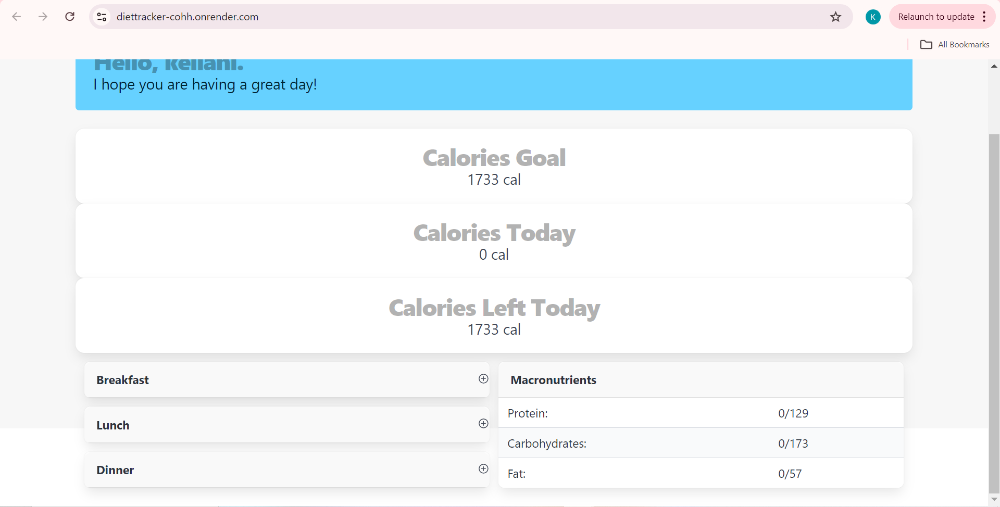
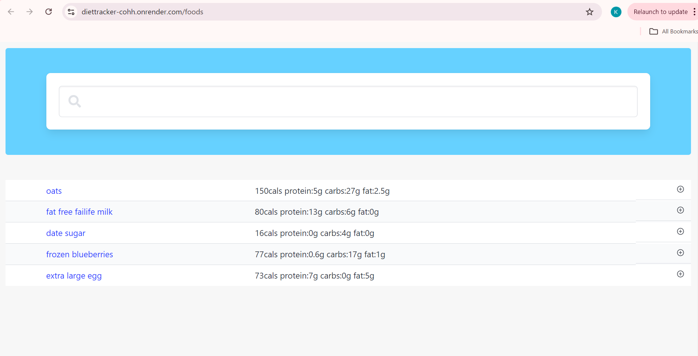
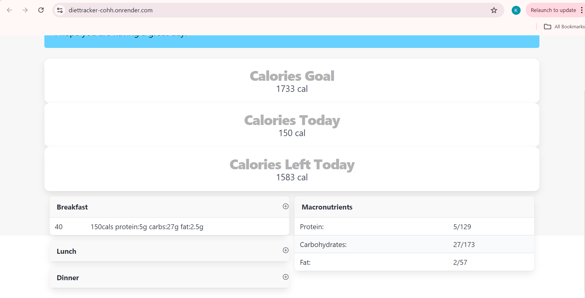

# Food_Tracker

## Description


Food Tracker is a web application designed to help users easily track their daily caloric intake and macronutrients. Users can create an account, log in, and track the calories and macronutrients (carbs, proteins, fats) of the food they consume throughout the day. The application allows users to log their meals, including breakfast, lunch, dinner, and snacks. Our comprehensive database provides detailed information on the macronutrient and calorie content of a wide variety of foods.

### Key Features:
- **User Authentication**: Create an account and log in securely.
- **Meal Tracking**: Log your daily meals by adding foods to breakfast, lunch, dinner, and snacks.
- **Nutritional Insights**: Access detailed information on the calories and macronutrients in each food item.
- **Progress Monitoring**: Keep track of your daily intake and see how it aligns with your dietary goals.


## Table of Contents


- [Installation](#installation)
- [Usage](#usage)
- [Credits](#credits)
- [License](#license)
- [Features](#features)
- [How to Contribute](#how-to-contribute)
- [Tests](#tests)


## Installation


To get the development environment running locally, follow these steps:


1. **Clone the repository**:
    ```bash
 git clone https://github.com/Kimiko-Dixon/Food_Tracker
    ```
2. **Navigate to the project directory**:
    ```bash
    cd food_tracker
    ```
3. **Install dependencies**:
    ```bash
    npm install
    ```
4. **Set up environment variables**:
   - Create a `.env` file in the root directory.
   - Add your environment-specific variables, such as database credentials, API keys, etc.


5. **Run the application**:
    ```bash
    node server.js
    ```


6. **Access the website**:
   - Open your web browser and navigate to `http://localhost:3001`.


## Usage


Once the application is running, you can:


1. **Create an Account**: Sign up by providing your email and password.
2. **Log In**: Use your credentials to log into your account.
3. **Track Your Meals**:
   - Navigate to the "Meals" section.
   - Add food items to your breakfast, lunch, dinner, or snacks.
4. **View Nutritional Information**:
   - See detailed macronutrient and calorie information for each food item you log.
   - Monitor your daily totals to stay on track with your goals.


### Example Screenshot






[Deployed Application](https://diettracker-cohh.onrender.com)

## Credits


This project was developed by [Kimiko](https://github.com/Kimiko-Dixon), [Emily](https://github.com/emangelic), [Lucca](https://github.com/Lucca's-Github), and [Erica](https://github.com/Ericameowzers).


We used the following resources:
- [Bootstrap](https://getbootstrap.com/) for the front-end framework.


## License


This project is licensed under the MIT License. See the [LICENSE](LICENSE) file for more details.


## Features


- **Comprehensive Food Database**: Access a wide range of foods with detailed nutritional information.
- **Daily Totals**: Easily view your total caloric and macronutrient intake for the day.
- **User-Friendly Interface**: Simple and intuitive design for easy tracking.


## How to Contribute


We welcome contributions to improve MacroTracker! If you’d like to contribute, please fork the repository and submit a pull request.


1. Fork the Project
2. Create your Feature Branch (`git checkout -b feature/AmazingFeature`)
3. Commit your Changes (`git commit -m 'Add some AmazingFeature'`)
4. Push to the Branch (`git push origin feature/AmazingFeature`)
5. Open a Pull Request
